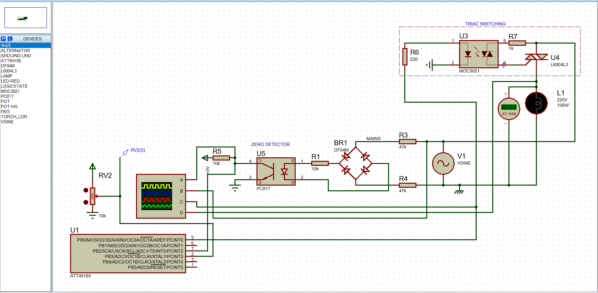

# IR Remote Controlled Switch and Fan Regulator

This project is an IR remote-controlled system designed to control four different 230V AC appliances, including a ceiling fan with speed regulation capability. The system is powered by an ATtiny85 microcontroller and uses direct register manipulation for precise control. It features non-volatile memory to retain the state of the switches during power outages.

## Features

- **Control 4 Appliances**: On/Off control for up to four 230V AC appliances.
- **Fan Speed Regulation**: One switch is capable of regulating the speed of a ceiling fan.
- **NEC Protocol**: Compatible with NEC IR remote signals using a TSOP1738 IR receiver.
- **Interrupt Driven**: Utilizes hardware and pin change interrupts for responsive control.
- **Non-Volatile Memory**: Saves the state of all switches during power loss and restores it when power is back.
- **Custom Power Handling**: The switches can handle up to 5A AC current, and the fan speed regulator port can handle up to 4A AC.
- **Direct Register Manipulation**: Optimized for performance and precision without relying on external libraries.

## Components Used

- **Microcontroller**: ATtiny85
- **IR Receiver**: TSOP1738
- **Relays**: Capable of handling up to 5A AC current
- **Triac**: BTA12 triac handles up to 4A AC current
- **Triac Driver**: MOC3021 optoisolator to drive the triac

## Circuit Diagram

## Code Explanation

The project uses direct register manipulation on the ATtiny85 to handle the IR remote signals and control the switching mechanism. The system is interrupt-driven, with both hardware interrupts and pin change interrupts being utilized for handling different IR signals.

- **Interrupt Setup**: Configures the ATtiny85 to handle IR signals efficiently using interrupts.
- **State Storage**: The state of each switch is stored in non-volatile memory (EEPROM) during power outages and restored upon power recovery.
- **Fan Speed Control**: Implemented using a phase-controlled dimmer circuit that adjusts the firing angle of a triac.

## Usage

- **Turning Appliances On/Off**: Use the corresponding buttons on the IR remote to toggle the switches.
- **Adjusting Fan Speed**: Use the designated buttons on the remote to increase or decrease the fan speed.

## Future Improvements

- **Expand to More Appliances**: Support for additional appliances.
- **Remote Learning**: Implement a learning mode for different types of IR remotes.
- **Feedback Mechanism**: Add an LED or display to show the current state of each switch and fan speed.

## Contributions

Contributions are welcome! Feel free to open issues or submit pull requests with improvements, bug fixes, or new features.

## Contact

For any inquiries or further questions, feel free to reach out via email at [Arinam](mailto:arinamchandra@gmail.com).
